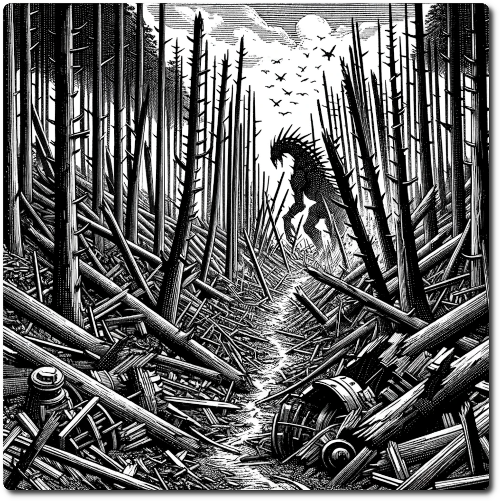

# 0502 - Forest - Trampled Forest

*The shear scale of destruction leaves not double, the Leviathan has been here.*

Forage: 8
Scout: 7

| Roll | Encounter Type | Description |
| ---- | -------------- | ----------- |
| 1    | Combat | **Forest Sentinels**: Ancient tree guardians, awakened by the Leviathan's destruction, rise to protect their domain with wooden limbs and crushing force. **Impact: 17, HP: 15, Loot: +2, 50  Gold** |
| 2    | Social | **Whispers of the Trees**: The spirits of the woods, disturbed by the chaos, communicate through the rustling leaves. Disruptions in the noosphere cause intrusive thoughts, lose 1 WP |
| 3    | Combat | **Root Ravagers**: Creatures mutated by the Leviathan's destructive energy, their forms twisted and gnarled, lash out at anything that moves through their shattered domain. **Impact: 16, HP: 12, Loot: +1, 50 Gold** |
| 4    | Social | **Displaced Hermit**: A hermit, his home destroyed by the Leviathan's path, possesses knowledge of the woods' secrets and seeks assistance. Draw 3 rumors, the return them to the rumors deck. If none of the rumors were about the Crisis!, draw one more, then return it to the deck. Shuffle the deck. |
| 5    | Combat | **Thorned Predators**: Stealthy predators, their bodies covered in sharp thorns, blend into the broken landscape, ready to strike at the unsuspecting. **Impact: 18, HP: 20, Loot: +3, 50 Gold** |
| 6    | Social/Combat | **Path of the Leviathan**: The trail left by the Braying-Leviathan holds both danger and discovery. Brave adventurers might find valuable relics amidst the destruction or face the wrath of creatures drawn to the Leviathan's residual energy. **Leviathan's Spawn**: **Impact (if combat): 20, HP: 25, Loot: Leviathan's Relic** |

**Path of the Leviathan**
- Make a forage roll, if success find the Leviathan's Relic with out disturbing the beasts. If the roll fails, the beasts strike at the would be thieves.

**Leviathan's Relic: Heart of the Wild**

The Leviathan's Relic is an artifact pulsating with an ancient, untamed energy. This luminescent core, cradled within a web of intertwining tentacles and fragmented crystals, seems to resonate with the very essence of the Braying-Leviathan.

- Upon activation, the Heart of the Wild emits a deep, resonant thrum, akin to the Leviathan's haunting bray, but harnessed and controlled. The party may instill a sense of unease and fear in enemies, reducing their Impact by 3 for the duration of the encounter. After use role 1d6 on a one it breaks, turning into 2 Ancient Tech.
