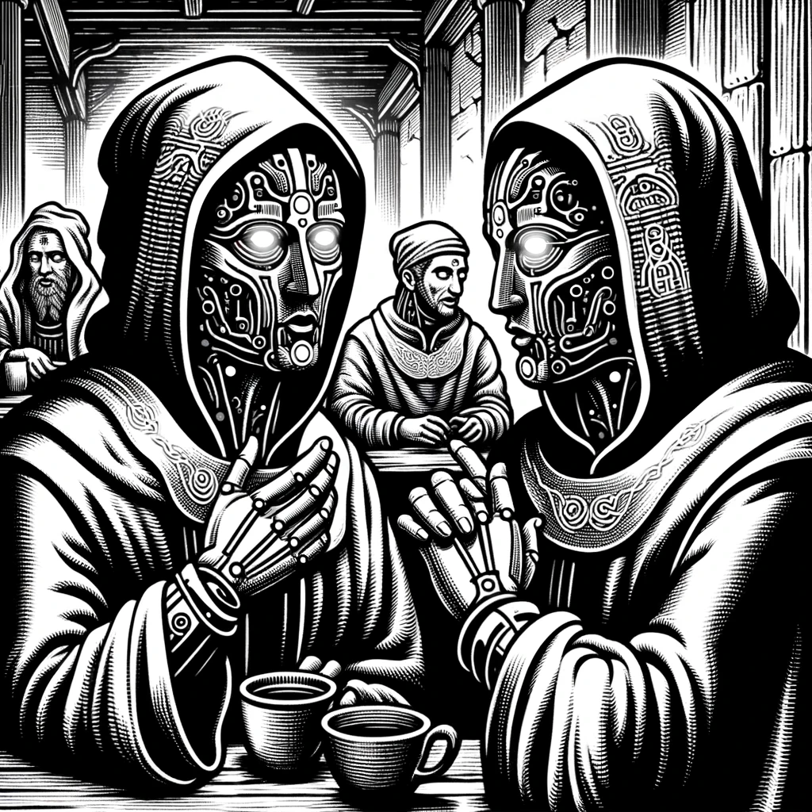

# Rumors

0106. "Farmers near the Golden Fields tell of a night when the stars hid and the ground shook, and a sound unlike any other filled the air. The fields now lie barren, they say, trampled by the Braying-Leviathan in its relentless march."

0303. "Miners in the Crystal Caverns have abandoned their picks and fled, whispering of tunnels collapsing and a monstrous shadow that moves through the rock, its braying echoes turning the crystals to dust."

0307. "Travelers from the Foggy Marshlands speak of a ground-shaking presence and a haunting bray that chills the soul. They say the marsh's mists now hide not just secrets, but the lurking form of the Braying-Leviathan."

0401. "Whispers in the back alleys of NeoArcadia hint at an uneasy alliance forming in the shadows. They say the Techno Bandits have ceased their raids, gathering instead at the edge of the Turing Woods, their eyes set on harnessing the power of the Braying-Leviathan for their cryptic machinations."

0502. "A lone scout returned from the Turing Woods, his eyes wide with fear, reporting trees uprooted and the earth torn asunder. He claims the Braying-Leviathan is carving a path of destruction through the woods, leaving a trail of shattered silence."

0808. "In the shadow of the Iron Mountains, blacksmiths report a terrifying disturbance, their forges gone cold as a chilling bray rolls down the slopes. They say the Braying-Leviathan now treads the mountain paths, its massive form casting a long shadow over the once-secure stronghold."

0906. "Merchants avoid the once-bustling trade route through the Gremion Ruins, speaking of an eerie bray that resonates through the water and a monstrous shape that stalks beneath the waves, toppling ancient pillars and relics."

[Crisis Table of Contents](Crisis/Leviathan-Awakes/Table-of-Contents)

Back to Game: [Table of Contents](../../Table-of-Contents.md#)

