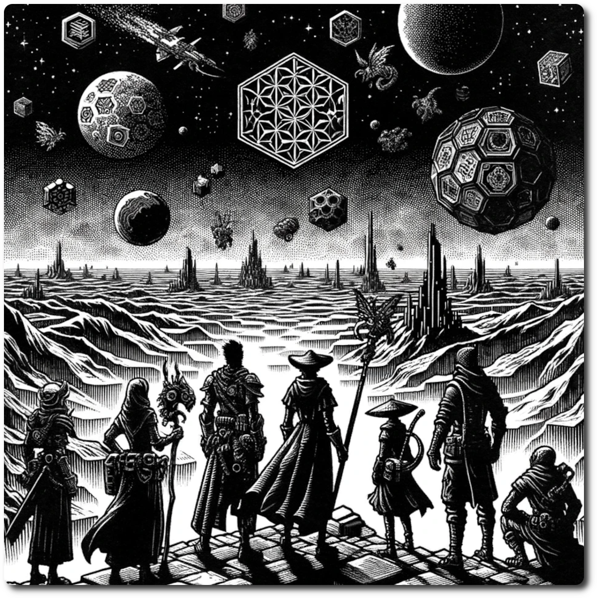

    
    
# Welcome to NeoArcadia: The Ancient Future Now!    
    
**Embark on a Journey Where the Ancient Future Collides with Brutal Reality!**    
    
Step into "NeoArcadia," a hexcrawl adventure set in a techno-fantasy world where ancient mysticism and far-flung futuristic technology blur dangerously. Here, the remnants of advanced civilizations blend with magic, creating a landscape both familiar and strange.    
    
**Navigate a Land Rife with Dangers!**    
    
Embark on a treacherous journey across a vast, hexagonally-tiled map filled with unseen threats. Each hex represents a world where the future's marvels are now forgotten relics, safeguarded by arcane traps, rogue AIs, and shadow-lurking mutated creatures.    
    
**Confront Relentless Challenges and Formidable Enemies!**    
    
Form a party of the bravest adventurers, each shaped by the harsh realities of this relentless world. Your tactical skills and survival instincts will be crucial as you traverse perilous landscapes, engage in fierce combat, and withstand extreme elements. Face remnants of ancient war machines, sorcerous experiments gone wrong, and hostile entities born from a harsh fusion of magic and technology.    
    
**Forge a Legacy of Survival, Glory, and Notoriety!**    
    
Will you uncover the secrets hidden within lost techno-temples, risking everything for ancient knowledge? Will you negotiate with beings spawned from the chaotic union of arcane and tech, or confront them with strength? Each decision is critical in your battle for survival, and your choices will carve your legacy into the unforgiving annals of this formidable land.    
    
[Play the Game](./Play-the-Game.html)  
    
[Table of Contents](./Table-of-Contents.html)

<a property="dct:title" rel="cc:attributionURL" href="https://neoarcadia.online">NeoArcadia: Ancient Future Now!</a> by <a rel="cc:attributionURL dct:creator" property="cc:attributionName" href="https://github.com/BlakeRhodes">Blake Rhodes</a> is licensed under <a href="http://creativecommons.org/licenses/by-nc-sa/4.0/?ref=chooser-v1" target="_blank" rel="license noopener noreferrer" style="display:inline-block;">CC BY-NC-SA 4.0</a>

